# Stress-controllable scenario generation architecture

```mermaid
flowchart LR
    A["Historical scenario CSV<br/>price, load, lambda<br/>calendar features, day_id"] --> B["Daily preprocessing<br/>sort by day_id and t<br/>keep complete 96-step days"]

    B --> C["Stress score modeling"]
    C --> C1["Hierarchical robust baseline<br/>(day_of_week, step)<br/>(weekend, step)<br/>(step)"]
    C1 --> C2["Daily pressure features<br/>level, ramp, duration<br/>joint high-pressure activity"]
    C2 --> C3["Percentile calibration<br/>stress_score in [0, 1]"]

    B --> D["Daily window construction"]
    C3 --> D
    D --> D1["Target windows<br/>X0: [N, 96, 3]<br/>price / load / lambda"]
    D --> D2["Token conditions<br/>[N, 96, 5]<br/>sin_hour, cos_hour,<br/>dow_sin, dow_cos, weekend"]
    D --> D3["Global conditions<br/>[N, 4]<br/>stress_score, dow_sin,<br/>dow_cos, weekend"]
    D1 --> D4["Min-max scaling<br/>targets to [-1, 1]"]

    D4 --> E["Mixed mask training"]
    D2 --> E
    D3 --> E
    E --> E1["Mask types<br/>reconstruction / random<br/>block / stride"]

    E1 --> F["Gaussian diffusion training"]
    F --> F1["Forward noising<br/>x_t = q(x_t | x_0)"]
    F1 --> G["TimeDiT-inspired denoiser"]
    D2 --> G
    D3 --> G
    G --> G1["Token input<br/>noisy targets + observed values<br/>observed mask + calendar tokens"]
    G --> G2["Global AdaLN conditioning<br/>diffusion step + stress score<br/>day-type context"]
    G1 --> H["Noise prediction loss<br/>MSE(eps_pred, eps)<br/>mask-weighted"]
    G2 --> H
    H --> I["Trained model bundle<br/>model weights, scaler,<br/>stress scorer, configs"]

    I --> J["Stress-controllable generation"]
    J --> J1["Select scenario type"]
    J1 --> J2["mainB<br/>sample target stress from<br/>central historical quantiles"]
    J1 --> J3["stressA<br/>sample target stress from<br/>high historical quantiles"]
    J2 --> K["Calendar condition construction"]
    J3 --> K
    K --> L["Reverse diffusion sampling<br/>generate candidate daily windows"]
    L --> M["Inverse scaling<br/>recover physical values"]
    M --> N["Candidate re-scoring<br/>compute realized stress_score"]
    N --> O["Candidate selection<br/>keep closest to target stress<br/>optionally add proxy utility"]
    O --> P["Generated scenario CSV<br/>price, load, lambda<br/>calendar fields, day_id"]
    O --> Q["Metadata CSV<br/>target stress, realized stress,<br/>distance, scenario label"]
```

## Suggested thesis figure layout

Use a five-column layout:

1. Historical Data and Daily Preprocessing
2. Automatic Stress Score Modeling
3. Conditional Diffusion Training
4. Stress-controllable Scenario Generation
5. Generated Scenarios and Metadata

Highlight the proposed part with a warm color:

- Stress score modeling
- Stress score as global conditioning
- Multi-candidate stress re-scoring and selection

Keep baselines or downstream EV control outside this figure. This figure should only explain the scenario generation module.
